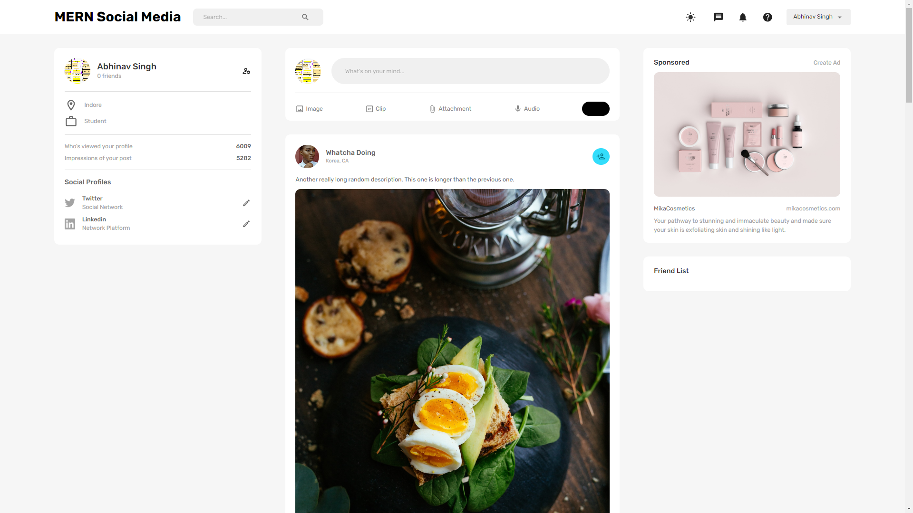
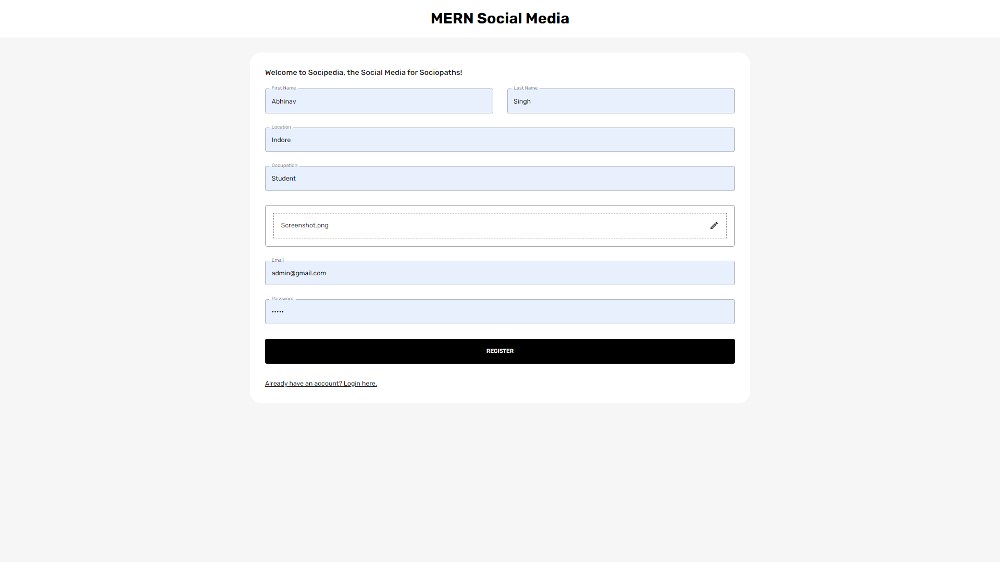

# Zero-Hate Social Media App

This is a social media app built using the MERN stack. It includes authentication, posts, likes, comments, and follows.

## Screenshots

### Home Page


### Profile Page



## Features

- Authentication
- Posts
- Likes
- Comments
- Follows

## Technologies

- MongoDB
- Express
- React
- Node.js

## Installation

1. Clone the repository
```bash
git clone https://github.com/imabhinavdev/mern-social-media.git
```

2. Install dependencies
```bash
cd mern-social-media
```

3. Install server dependencies
```bash
cd server
npm install
```

4. Install client dependencies
```bash
cd client
npm install
```

5. Run the app
```bash
cd server
npm run start
```

